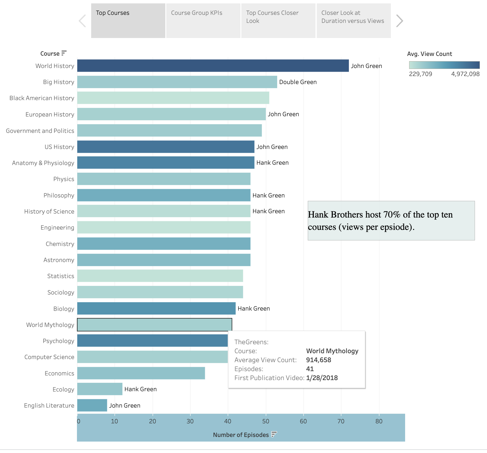

# crashcourse
Analyzing stats of longtime favorite YouTube channel: Crash Course.
## Purpose:
Crash Course is a beloved and powerful educational tool used by teachers and students around the world. Launching on YouTube in 2012, the channel has produced over 40 seasons of courses over topics from biology to film production.

The purpose of this project is to examine the different courses provided to find trends and answer questions regarding course topics that lend to greater success such as:
1. Which genre of courses are the most successful (have the most views, likes, comments...)?
2. Are there any trends in the video statiscs over an individual course's duration (accross its season)?
3. Are there any trends in video statistics through the history of crashcourse?

 ## Methodology:

 ### ETL in Python: 
Extract: Data was pulled from YouTube's API using the channel ID to get a list of the video ids. Then a for loop was constructed to pull the statistics for each video and store the results in a list of dictionaries. A Pandas dataframe was constructed from the list of dictionaries. 

Transform: Data was cleaned using a series of functions to pull out information from the long epsidoe titles such as the course, the episode, and the individual episode title. The parsed information became additiona columns. The published date was converted to datetime format and parsed for the day and time of publication. The duration/length of the videos were converted to seconds. The days seince publication was calculated. Redundant or unuseful columns were removed. 

Load: The final dataframe was loaded as a csv file for use in Tableau.

 ### Data Exploration and Summary in Tableau:

[Tableau Story (Dashbaords)](https://public.tableau.com/app/profile/jennifer.shulyak/viz/CrashCourseAnalysis/Story1?publish=yes)

 ## Analysis:

 

 * The top ten courses: World History, Big History, US History, Anatomy & Physiology, Philosophy, Biology, Psychology, English Literature, Chemistry, and astronomy. 
 * The Green brothers host 70% of the top ten courses (by view per episode).
 * 4/5 of the longest courses are of the history genre.
 * Views range from 229,709 to 4,972,048 per epsiode on average.
 * World History has the largest number of views per episode: 4,972,048.
  

 

 * The most popular genre of courses: History, English, the Social Sciences, and the Living Sciences.
 * The lesat popular genre of courses: Film, College Readiness, Computer/Engineering, and Media Literacy.
 * Average duration of episodes range: 10-13 minutes.
 * Film episodes have the lowest comment rate (221) and like count (5,802) indicating a lower impact on viewsers (lower participation). Film is not a requrie subject of study for high school students in the United States. 
 * English Literature episodes have the highest comment rate (3,418) and like count (35,491) indicating a high impact on viewers (high participation). This could be due to students using books covered for school and all students in the United States must take English Literature to graduate high school. 

 
 * The view count & like count drop and the duration of each episode rises over the course of a season regardless of genre.
 * The number of comments per episode over a season rises for some courses and falls for others. There does not appear to be a pattern. 

 
 * There is no correlation between view count and episode duration.
 * There is no correlation between like count and episode duration.

 ## Conclusion: 
 *  Would recommend Crash Course invest more resources towards history courses.
 *  It may be worthwhile to focus on producing more courses with shorter seasons.

